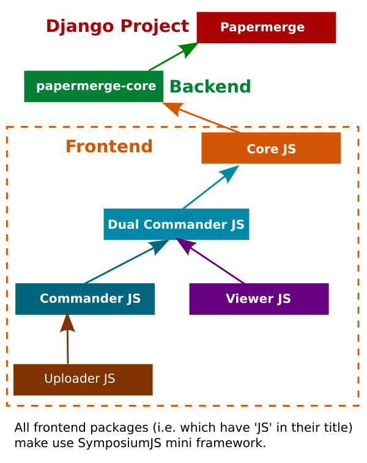

### Hi there, 👋, I am Eugen,

I am Django/Python/JavaScript developer.

- 🌱 I’m lead developer of [Papermerge](https://www.papermerge.com)
- 📫 Reach me via [email](mailto:eugen@papermerge.com)
- :round_pushpin: I live in Berlin, Germany
- ⚡ Fun fact: I speak English, German, Romanian and Russian languages

I graduated in 2007 Bachelor of Computer Science (5 years course) at
Politehnica University of Bucharest (Romanian: Universitatea Politehnica din
București). Although I worked in many IT areas, nowadays I am primarily
focused on **cloud** technologies.

Papermerge is an open source document management system for scanned documents
(PDF documents, JPEG, PNG, TIFF scans). Its source code is split into many
reusable packages. Each of these packages is part of [Papermerge Organization]
(https://github.com/papermerge).

Following is the list and a diagram of Papermerge projects ecosystem:

* [Papermerge](https://github.com/ciur/papermerge) - Django project which bundles all pieces together
* [Papermerge Core](https://github.com/papermerge/papermerge-core) - Backend central piece. The heart of Papermerge. This is a [python package](https://pypi.org/project/papermerge-core/).
* [Papermerge CoreJS](https://github.com/papermerge/core-js) - Frontend central piece
* [Dual Commander JS](https://github.com/papermerge/dual-commander-js) - Frontend's dual panel document browser. This is a [nodejs package](https://www.npmjs.com/package/@papermerge/dual-commander).
* [Commander JS](https://github.com/papermerge/commander-js) - Frontend's single panel document browser (used by [dual commander](https://github.com/papermerge/dual-commander-js)). This is [nodejs package](https://www.npmjs.com/package/@papermerge/commander).
* [Viewer JS](https://github.com/papermerge/viewer-js) - Frontend's document viewer (used by [Dual Commander](https://github.com/papermerge/dual-commander-js)). This is a [NodeJS package](https://www.npmjs.com/package/@papermerge/viewer).
* [Uploader JS](https://github.com/papermerge/uploader-js) - Frontend's uploader component (used by [Commander JS](https://github.com/papermerge/commander-js)). This is a [NodeJS package](https://www.npmjs.com/package/@papermerge/uploader).
* [Symposium JS](https://github.com/papermerge/symposium-js) - A mini (javascript) framework used across all papermerge frontend code. This is a [NodeJS package](https://www.npmjs.com/package/@papermerge/symposium).
* [Documentation](https://github.com/papermerge/documentation) - Sphinx based documentation repository.

